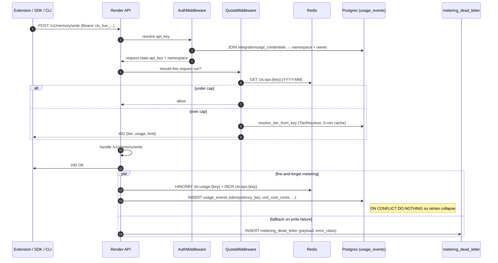
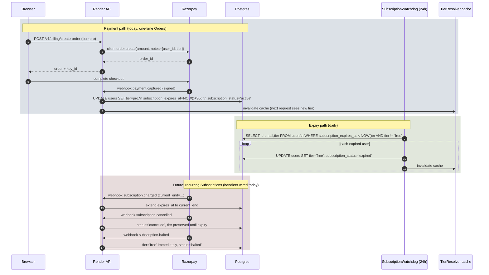
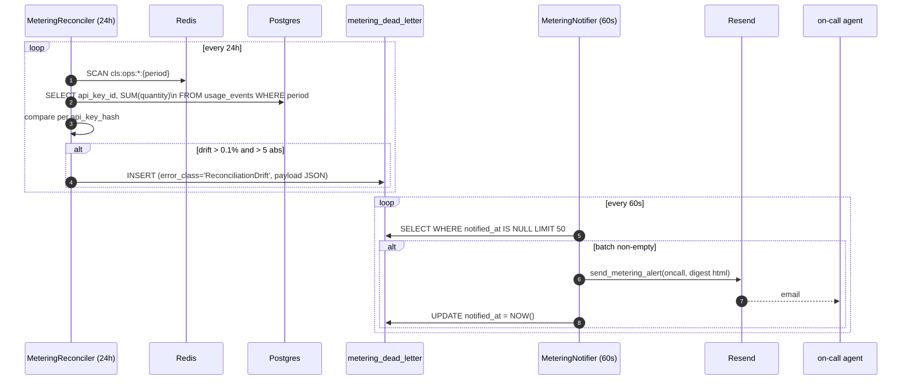
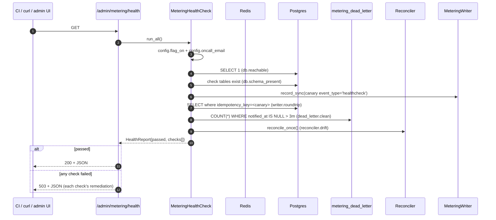

# CLS++ — High Level Design

**Status:** living document · last major update 2026-04-22

This is the system-level view. For component internals, see [LLD.md](LLD.md).
For individual architectural decisions, see `docs/adr/`.

---

## 1 · What CLS++ is

CLS++ is a **cross-LLM memory-as-a-service**. Customers install a Chrome
extension or use the SDK / CLI; their chat context with one model (Claude,
GPT, Gemini) is captured, consolidated through a phase-engine, and
transparently re-injected when they switch to a different model. The
service is billed per monthly operation count, with a flat tier + pay-as-you-go
overage pricing model.

---

## 2 · Deployment shape

```
               ┌──────────────────────────┐
Users ──────►  │  Vercel (Next.js 16)     │  https://www.clsplusplus.com
  (browser,    │  • marketing site        │
   Chrome      │  • signup / login        │
   extension,  │  • /profile, /admin      │
   SDK, CLI)   │  • /api/* → rewrite      │
               └────────────┬─────────────┘
                            │ server-side rewrite
                            ▼
               ┌──────────────────────────┐
               │  Render (FastAPI)        │  https://clsplusplus.onrender.com
               │  • memory engine         │
               │  • billing + metering    │
               │  • admin APIs            │
               │  • OAuth callbacks       │
               └────────────┬─────────────┘
                ┌───────────┼────────────┬─────────────┐
                ▼           ▼            ▼             ▼
           ┌────────┐  ┌───────┐  ┌──────────┐  ┌─────────┐
           │Postgres│  │ Redis │  │  MinIO   │  │ Resend  │
           │(pgvec) │  │(rate  │  │ (L3 +    │  │ (email) │
           │        │  │ limit,│  │ cls-     │  │         │
           │        │  │ ops   │  │ metering)│  │         │
           │        │  │ cntr) │  │          │  │         │
           └────────┘  └───────┘  └──────────┘  └─────────┘
```

**Key architectural decisions** (recorded in ADRs):

- `api.clsplusplus.com` does **not** serve the UI. Vercel owns `www.` and
  server-side rewrites `/api/v1/*` and `/api/admin/*` to the Render host.
  This is why OAuth redirect URIs must register on `www.` not `api.`
  ([ADR 0001 §Context](adr/0001-metering-data-lake.md)).
- Session cookies use `Domain=.clsplusplus.com` so the cookie set by the
  backend (delivered through the Vercel proxy) is valid on both `www.` and
  any future subdomains. See `CLS_COOKIE_DOMAIN` in config.
- Metering is moving from a Redis-only counter pipeline to an append-only
  durable event log in Postgres, with Parquet archives on MinIO for ≥30-day
  history. Implementation is staged 1→8; steps 1–3 plus healthcheck are
  live (see [ADR 0001 §6 rollout](adr/0001-metering-data-lake.md)).

---

## 3 · Top-level flows

The next sections give a high-level sequence for each major flow. Low-level
details, class diagrams, and error paths are in [LLD.md](LLD.md).

### 3.1 · User onboarding (email or OAuth)

```mermaid
sequenceDiagram
    autonumber
    participant Browser
    participant Vercel as Vercel (UI + proxy)
    participant API as Render API
    participant OAuth as Google / GitHub
    participant DB as Postgres (users)
    participant Mail as Resend

    alt Email + password signup
        Browser->>Vercel: POST /api/v1/auth/register
        Vercel->>API: POST /v1/auth/register (proxied)
        API->>DB: INSERT pending_registrations (OTP hash, expiry)
        API->>Mail: send_verification_email(OTP, magic link)
        API-->>Vercel: {pending: true}
        Browser->>Vercel: submit OTP at /verify-email
        Vercel->>API: POST /v1/auth/verify-register
        API->>DB: INSERT users (email, password_hash, email_verified=true)
        API-->>Browser: Set-Cookie cls_session; redirect /profile
    else OAuth (Google or GitHub)
        Browser->>Vercel: click "Continue with Google"
        Browser->>Vercel: GET /api/v1/auth/google?redirect=/profile
        Vercel->>API: GET /v1/auth/google
        API-->>Browser: 307 → accounts.google.com/...&redirect_uri=www/.../callback
        Browser->>OAuth: consent
        OAuth-->>Browser: 302 → /api/v1/auth/google/callback?code=...
        Browser->>Vercel: GET /api/v1/auth/google/callback?code=...
        Vercel->>API: proxied GET
        API->>OAuth: exchange code (client_secret)
        OAuth-->>API: {access_token, id_token}
        API->>OAuth: GET /userinfo
        API->>DB: UPSERT users (link google_id, auto-verify email)
        API-->>Browser: Set-Cookie cls_session; 302 → www.clsplusplus.com/profile
    end
```

### 3.2 · Authenticated API call → metering → quota enforcement

Every memory API call goes through this path. The durable event log is the
safety-net source of truth; the Redis counter is the hot path today.



### 3.3 · Payment, tier upgrade, subscription expiry

All paid tiers now stamp `subscription_expires_at`. The watchdog runs daily
and auto-downgrades rows whose window has elapsed.



### 3.4 · Metering safety loop (reconciler + notifier)

The reconciler proves the durable log and the Redis counter agree. Any drift
turns into a `metering_dead_letter` row, the notifier pages on-call.



### 3.5 · Health self-check (on-demand or monitoring)

A single endpoint answers "is metering alive?" with seven sub-checks. Used
by CI, by humans, and wired to the admin dashboard.



---

## 4 · Cross-cutting concerns

| Concern | Primary mechanism | Fallback / safety |
|---|---|---|
| Auth | `AuthMiddleware`: Bearer API key or `cls_session` JWT cookie | 401 if both fail and `CLS_REQUIRE_API_KEY=true` |
| Rate limit | `RateLimitMiddleware`: per-key sliding-window in Redis | fails open if Redis down (documented trade-off) |
| Quota | `QuotaMiddleware`: per-user tier via `TierResolver` | fail-**closed** (503 + Retry-After) by default; override with `CLS_QUOTA_FAIL_CLOSED=false` |
| Metering write | `MeteringWriter.record()` fire-and-forget → `usage_events` | fallback to `metering_dead_letter` + oncall email |
| Pricing | `MeteringPricer.price_event()` — stamps `unit_cost_cents` at write time | defaults to 0 when `CLS_OVERAGE_RATES_CENTS` unset = no accidental bill |
| Subscription | `payment.captured` → set `expires_at = NOW()+30d` | `SubscriptionWatchdog` scans daily for elapsed windows → downgrade |
| OAuth | Redirects go through Vercel proxy so Set-Cookie lands on `.clsplusplus.com` | `CLS_*_REDIRECT_URI` env vars override the computed URI |
| Observability | Structured logs + dead-letter paging | `/admin/metering/health` exposes everything in one JSON |

---

## 5 · Sources of truth (SoT)

| Domain | SoT today | SoT after ADR 0001 fully lands |
|---|---|---|
| User identity | `users` table | unchanged |
| API keys | `api_credentials` (hashed) | unchanged |
| Tier (paid) | `users.tier` | unchanged |
| Subscription window | `users.subscription_expires_at` | unchanged |
| Per-API-key ops count (this month) | Redis `cls:ops:{key}:{period}` | `usage_events` (step 5) |
| Per-API-key usage history | Redis `cls:usage:{key}:{period}` + monthly_metrics | `usage_events` + Parquet on MinIO (step 6) |
| Billing reconciliation | none | daily reconciler diff (step 3 — live) |

---

## 6 · Security model (summary)

- **Secrets** live only in Render env / Vercel env / GitHub Actions secrets — never in code.
- **Admin endpoints** are gated on `request.state.is_admin` which is set only when a valid JWT carrying `is_admin=true` is presented.
- **API keys** are SHA-256 hashed at rest; only prefixes are logged.
- **PII in telemetry**: extension `site` URLs are treated as PII — hashed at write time (owner decision in ADR 0001).
- **Webhook signatures** are HMAC-verified before any side effect; bad signature → raise, never silently process.
- **Fail-closed** on quota check errors by default — billing correctness > availability during Redis outages.

---

## 7 · Regression gates

Three independent layers:

1. **Unit tests** — `ci.yml` runs `pytest tests/` on every push + PR across Python 3.10 / 3.11 / 3.12 with Postgres + Redis services. Full suite: 161+ tests.
2. **Live E2E** — `prod-smoke.yml` runs `tests/test_billing_e2e.py` against production every 15 min, on every push to `main`, and on manual dispatch. 16 tests covering the whole billing spine.
3. **Healthcheck endpoint** — `/admin/metering/health` is cheap enough to wire to an uptime monitor (503 on failure).

If all three are green, the metering + billing pipeline is behaving correctly end-to-end.

---

## 8 · What's next

Tracked in ADR 0001, step by step:

- [ ] Step 4 — `MeteringQuery` read interface (UI + `check_quota` read from `usage_events` not Redis)
- [ ] Step 5 — cut reads over behind per-endpoint flag
- [ ] Step 6 — Parquet rollup daily → MinIO (the "data lake" proper)
- [ ] Step 7 — backfill 6 months of Redis history
- [ ] Step 8 — retire Redis TTLs

Other forward-looking items:

- Migrate Razorpay client from **one-time Orders** to **recurring Subscriptions** (webhook handlers already wired).
- Grace-period policy on failed payments (currently: immediate halt on `subscription.halted`).
- Customer-facing "subscription expired" email (hook exists on `SubscriptionWatchdog.notify`; receiver TBD).
